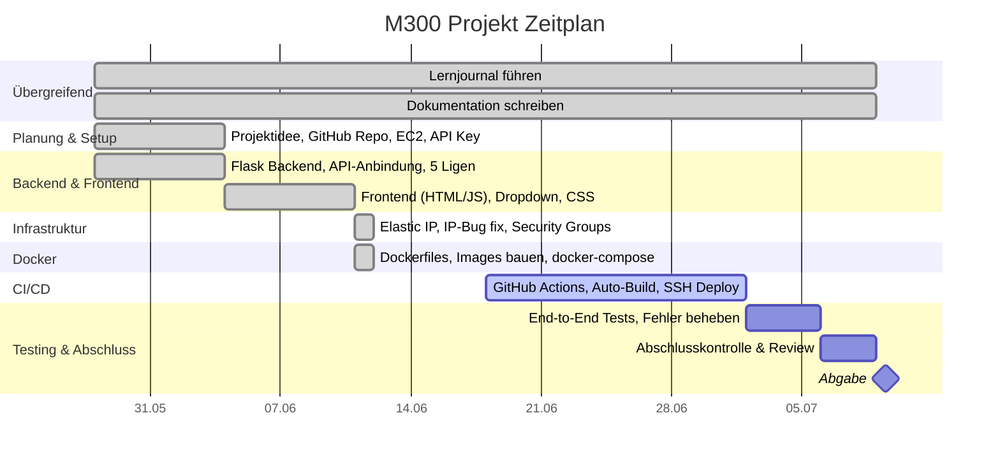

# Zeitplan – M300 Fussball Dashboard

---

## Übersicht nach Datum

| Datum | Schwerpunkt |
|-------|-------------|
| Do, 28.05. | Planung, EC2 Setup, Flask Backend, API-Anbindung |
| Do, 05.06. | Frontend, 5 Ligen, CORS, CSS Styling |
| Do, 11.06. | Elastic IP, IP-Bug fix, Docker, docker-compose |
| Do, 18.06. | GitHub Actions CI/CD einrichten |
| Do, 25.06. | CI/CD testen & optimieren |
| Do, 02.07. | End-to-End Testing |
| Do, 09.07. | Abschlusskontrolle, **Abgabe** |

### Version & Stand

Version vom 11.06.2026, der Zeitplan wird jede Woche Aktualisiert nach dem neusten Stand.

Aktueller Stand ist 11.06.2026 09:09:30 Uhr

Dominik Hausammann
