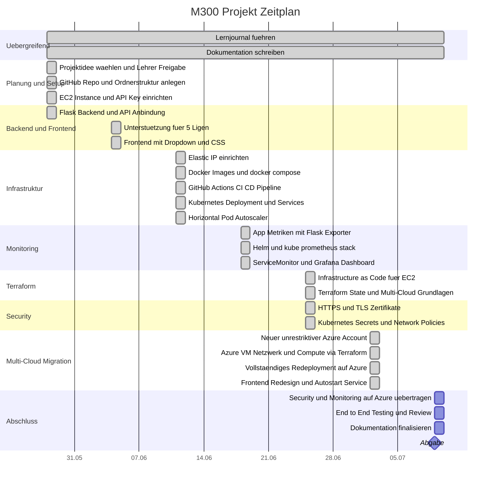

# Zeitplan – M300 Fussball Dashboard

---

## Übersicht nach Datum

| Datum | Schwerpunkt |
|-------|-------------|
| Do, 28.05. | Planung, EC2 Setup, Flask Backend, API-Anbindung (krankheitsbedingt verkürzt) |
| Do, 04.06. | Frontend, 5 Ligen, CORS, CSS Styling |
| Do, 11.06. | Elastic IP, IP-Bug fix, Docker, CI/CD, Kubernetes, HPA (alles an einem Tag umgesetzt) |
| Do, 18.06. | Monitoring: Prometheus, Grafana, Helm, ServiceMonitor, Dashboard |
| Do, 25.06. | Terraform: Infrastructure as Code, Multi-Cloud Grundlagen (AWS + Azure Resource Group); Security: HTTPS/TLS, Kubernetes Secrets, Network Policies |
| Do, 02.07. | Vollständige Multi-Cloud Migration: neuer Azure Account, komplette Infrastruktur (VM, Netzwerk) via Terraform, Applikation komplett auf Azure redeployed, Frontend-Redesign, Autostart-Service |
| Do, 09.07. | Security/Monitoring auf Azure übertragen, End-to-End Testing, Review, Doku finalisieren, **Abgabe** |

---

### Version & Stand

Version vom 02.07.2026, der Zeitplan wird jede Woche aktualisiert nach dem neusten Stand.
Letzter Arbeitstag ist der 09.07.2026.
Aktueller Stand ist 02.07.2026, Woche 8 abgeschlossen.

Dominik Hausammann
